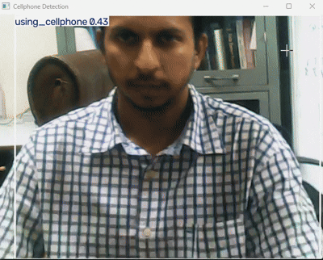
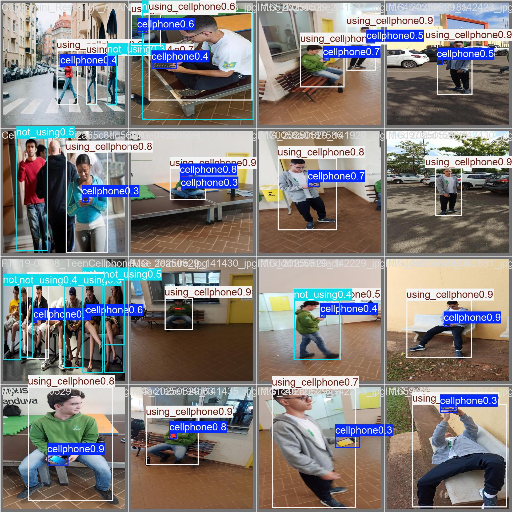
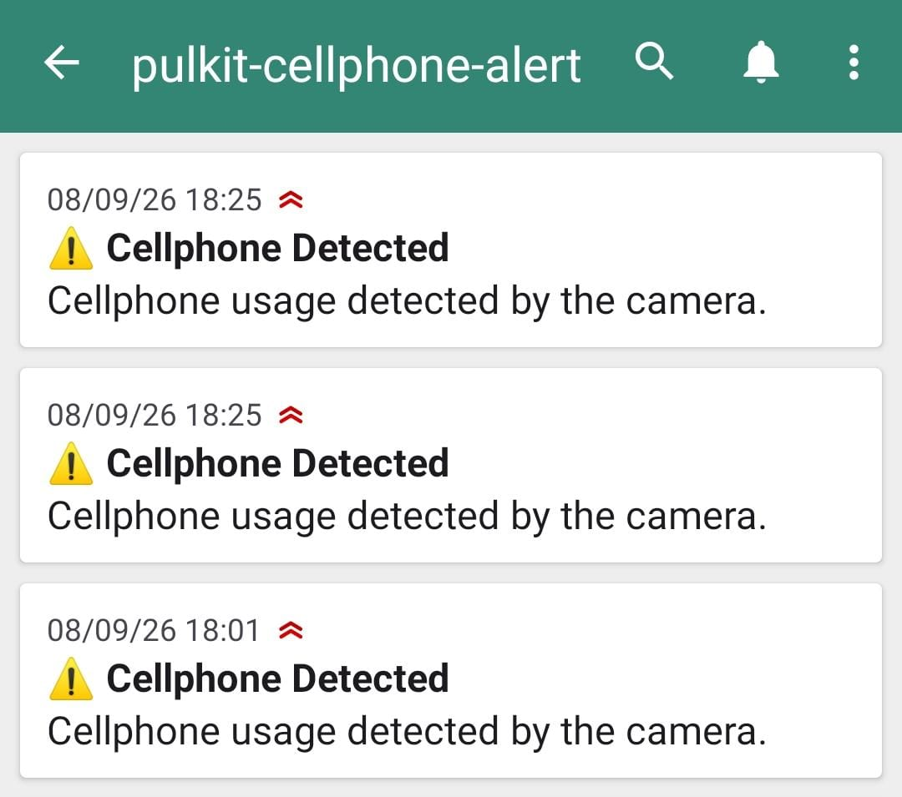

# 📱 Cellphone Usage Detection with YOLOv8 + NTFY Alert

A real-time **cellphone usage detection system** using **YOLOv8 and OpenCV**.
When a cellphone is detected by the camera, the system:

1. 🔔 Plays an alarm on the computer.
2. 📲 Sends an instant notification through **NTFY** to a caretaker or supervisor.
3. 🎥 Continues monitoring the camera in real time.

The system can be used in environments such as **student study monitoring, classrooms, libraries, examination areas, and supervised learning spaces**.


<div align="center">

</div>

---

## 🚀 Project Overview

The objective of this project is to automatically detect cellphone usage from a live camera feed and generate an immediate alert.

<div align="center">

</div>

<div align="center">

</div>


### System Flow

```text
        Camera / Webcam
              │
              ▼
       OpenCV Video Capture
              │
              ▼
          YOLOv8 Model
              │
              ▼
     Cellphone Detected?
          │        │
         NO       YES
          │        │
          │        ├──────────────► 🔔 System Alarm
          │        │
          │        └──────────────► 📲 NTFY Notification
          │                         to Caretaker
          │
          └────────► Continue Monitoring
```

---

## 🧠 AI Model Development

### 1. Image Collection

Images for cellphone detection were collected and prepared using **Roboflow**.

Roboflow was used for:

* Image collection
* Dataset organization
* Image annotation
* Dataset preparation for YOLO training

The dataset contains images with cellphone instances that the model learns to identify.

### 2. Model Training

The prepared dataset was used to train a **YOLOv8 object detection model**.

The trained model generates:

* Bounding boxes around detected cellphones
* Confidence scores
* Detection class

The trained model is saved as:

```text
runs/detect/train/weights/best.pt
```

---

## 🛠️ Technologies Used

| Technology             | Purpose                            |
| ---------------------- | ---------------------------------- |
| **Python**             | Main programming language          |
| **YOLOv8**             | Cellphone object detection         |
| **Ultralytics**        | YOLOv8 implementation              |
| **OpenCV**             | Real-time camera processing        |
| **Roboflow**           | Dataset preparation and annotation |
| **NTFY**               | Remote notification system         |
| **Windows `winsound`** | Local alarm generation             |

---

## 📂 Project Structure

```text
cellphone-detection/
│
├── train.py
├── alarm.wav
├── README.md
│
└── runs/
    └── detect/
        └── train/
            └── weights/
                └── best.pt
```

---

## ⚙️ Installation

Install the required Python packages:

```bash
pip install ultralytics opencv-python requests
```

`winsound` is built into Windows, so it does not require a separate installation.

---

## 🔔 Alarm Setup

The project uses a WAV file for the local alarm.

Place your alarm file in the project directory:

```text
alarm.wav
```

The alarm is triggered when the YOLO model detects the `cellphone` class.

---

## 📲 NTFY Notification

The project uses **NTFY** to send notifications to a caretaker or supervisor.

Example configuration:

```python
NTFY_TOPIC = "pulkit-cellphone-alert"
NTFY_URL = f"https://ntfy.sh/{NTFY_TOPIC}"
```

When a cellphone is detected, the system sends:

```text
Cellphone usage detected by the camera.
```

### NTFY Setup

Subscribe to the same topic on the caretaker's mobile device using the NTFY application.

For example:

```text
pulkit-cellphone-alert
```

Once subscribed, the caretaker receives a notification whenever cellphone usage is detected.

---

## ▶️ Running the System

Make sure the camera is connected and the trained model exists at:

```text
runs/detect/train/weights/best.pt
```

Then run:

```bash
python train.py
```

The application opens the camera and displays the YOLO detection results.

Press:

```text
Q
```

to stop the application.

---

## 🎯 Detection Logic

The system checks every camera frame for the `cellphone` class.

When a cellphone is detected:

```text
Cellphone detected
       │
       ├──► Play alarm.wav
       │
       └──► Send NTFY notification
```

To avoid sending notifications continuously for every frame, the program maintains an alert state.

A new notification is generated after the cellphone disappears from the camera view and is detected again.

---

## 🎓 Applications

### Student Study Monitoring

Useful for supervised study environments where cellphone usage needs to be monitored.

### 📚 Libraries

Can be deployed in libraries or quiet study areas to detect unauthorized or unwanted cellphone use.

### 🏫 Classrooms

Can provide an automated indication when students use mobile phones during monitored sessions.

### 📝 Examination Monitoring

The system can be integrated with camera-based monitoring systems to assist supervisors in identifying cellphone usage.

### 👴 Assisted / Supervised Environments

The same detection-and-alert architecture can be adapted for other situations where a remote caretaker needs to receive an immediate visual-event notification.

---

## 🔄 Future Improvements

Possible extensions include:

* RTSP/IP camera support
* Multiple camera integration
* Cloud-based image storage
* WhatsApp/SMS alerts
* Detection logging with timestamps
* Alert cooldown and configurable thresholds
* Edge deployment on Raspberry Pi or other embedded platforms
* Integration with a larger surveillance or robotics system

---

## 📌 Key Features

✅ Real-time cellphone detection
✅ YOLOv8 object detection
✅ Roboflow-based dataset preparation
✅ Local computer alarm
✅ Remote NTFY notification
✅ Automatic alert control
✅ OpenCV camera integration
✅ Suitable for supervised learning environments

---

## 👨‍💻 Project Workflow

```text
        DATASET
           │
           ▼
       ROBOFLOW
   Images + Annotation
           │
           ▼
       YOLOv8 Training
           │
           ▼
        best.pt
           │
           ▼
      Live Camera
           │
           ▼
     YOLOv8 Detection
           │
           ▼
    Cellphone Detected
        /         \
       /           \
      ▼             ▼
  System Alarm    NTFY Alert
                    │
                    ▼
               Caretaker
```

---

## 👨‍🔬 Project Relevance

This project demonstrates practical experience in:

* Computer vision
* Object detection
* YOLO-based AI systems
* Real-time video processing
* AI model deployment
* Camera-based monitoring
* Embedded/robotics-oriented alert systems
* IoT-style remote notification

It can serve as a building block for larger **AI-based monitoring, safety, and autonomous robotic systems**.
